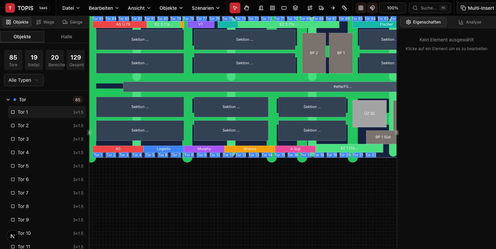
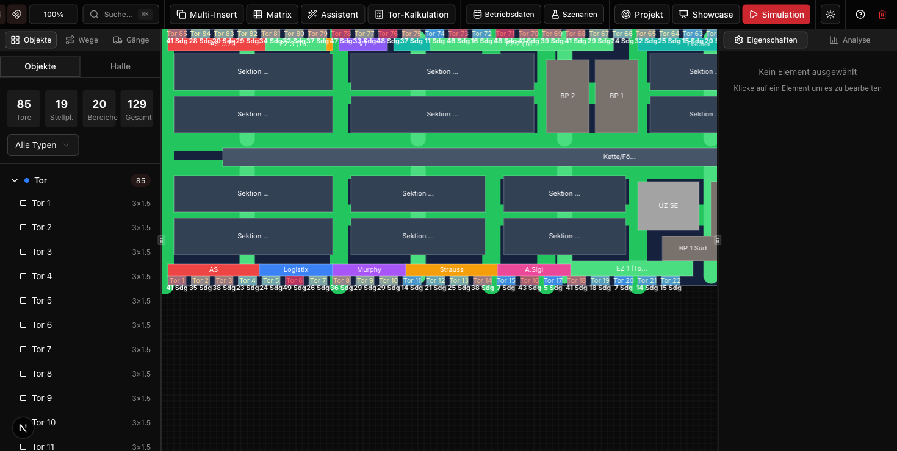

# TOPIS SaaS — Logistik-Hallenplanung

Webbasiertes Planungs- und Analysetool für Stückgut- und Logistikhallen. TOPIS verbindet Hallenlayout-Zeichnung mit operativen Betriebsdaten, Heatmap-Visualisierung und Szenario-Vergleich.

**Live-Demo:** [roth-jan.github.io/topis-saas](https://roth-jan.github.io/topis-saas/)



## Features

### Hallenplanung
- Maßstabsgetreuer 2D-Hallenplan (HTML5 Canvas, 10 px/m)
- Objekt-Typen: Tore, Stellplätze, Bereiche, Büros, Entladezonen, Hindernisse
- Drag & Drop, Mehrfach-Einfügen (Serienanordnung), Raster-Snap
- Gänge, Wege, Förderbänder (Conveyor) mit Wegberechnung
- Hallen-Vorlagen (z.B. Andreas Schmid Halle 6 — 150m x 42m, 85 Tore)

### Betriebsdaten & Heatmap
- CSV-Import von Scan-/Betriebsdaten (Messpunkt, Sendungen, Colli, Gewicht)
- Heatmap-Overlay auf Toren (Farbskala: Grün-Rot, Blau-Rot, Mono)
- 5 Metriken: Sendungen/Tag, Colli/Tag, Gewicht/Tag, Auslastung, Ladezeit
- Demo-Daten-Generator für schnellen Einstieg



### Szenarien
- Layout-Snapshots speichern (IST-Zustand, Optimierung, etc.)
- Szenarien vergleichen und wiederherstellen
- Vorher/Nachher-Analyse

### Weitere Features
- Showcase-Demo (automatisierter Workflow)
- Simulation & Tor-Kalkulation
- Command Palette (Cmd+K)
- Export/Import (JSON)
- Dark/Light Theme

## Tech Stack

| Kategorie | Technologie |
|-----------|-------------|
| Framework | Next.js 16 (App Router) |
| UI | React 19 + TypeScript |
| Styling | Tailwind CSS 4 + shadcn/ui (Radix UI) |
| State | Zustand |
| Canvas | HTML5 Canvas 2D |
| Deployment | GitHub Pages (Static Export) |

## Setup

```bash
git clone https://github.com/roth-jan/topis-saas.git
cd topis-saas
npm install
npm run dev
```

Öffne http://localhost:3000/topis-saas/projekt

## Build & Deploy

```bash
npm run build    # Static Export nach out/
```

Deploy auf GitHub Pages erfolgt über den `gh-pages` Branch.

## Projektstruktur

```
src/
  app/
    (editor)/projekt/page.tsx       # Hauptseite (3-Panel Layout)
    layout.tsx                       # Root Layout
    page.tsx                         # Landing Page
  components/
    canvas/HallCanvas.tsx            # Canvas-Rendering + Hit-Detection
    editor/
      Toolbar.tsx                    # Werkzeugleiste
      ObjectList.tsx                 # Objektliste (links)
      PropertiesPanel.tsx            # Eigenschaften (rechts)
      CommandPalette.tsx             # Cmd+K Suchpalette
    panels/
      GangPanel.tsx                  # Gang-Verwaltung
      PathPanel.tsx                  # Wege-Verwaltung
      AnalyticsPanel.tsx             # Analyse-Panel
    dialogs/
      BetriebsdatenImportDialog.tsx  # CSV-Import + Heatmap-Steuerung
      SzenarienDialog.tsx            # Szenarien-Verwaltung
      ShowcaseDialog.tsx             # Demo-Workflow
      MultiInsertDialog.tsx          # Mehrfach-Einfügen
      HallenAssistentDialog.tsx      # Hallen-Assistent
  lib/
    store.ts                         # Zustand Store (Layout-Daten)
    betriebsdaten-store.ts           # Zustand Store (Betriebsdaten)
    heatmap-utils.ts                 # Heatmap-Farben + Metriken
    analytics.ts                     # Produktivitätsanalyse
    pathfinding.ts                   # Wegberechnung
    layouts/schmid-halle6.ts         # Andreas Schmid Vorlage
  types/
    topis.ts                         # TypeScript-Typen + Konstanten
    betriebsdaten.ts                 # Betriebsdaten-Typen
```

## Hintergrund

TOPIS digitalisiert die Beratungsmethodik der ROTH Logistikberatung für Umschlaghallen-Optimierung. In klassischen Beratungsprojekten werden Hallenlayouts, Scan-Daten, Prozesszeiten und Benchmarks manuell in 10+ Excel-Dateien ausgewertet. TOPIS automatisiert diesen Workflow als Self-Service-Tool für Logistikdienstleister.

### Referenzprojekt: Andreas Schmid Logistik
- Standort Gersthofen: 150m x 42m Umschlaghalle, 85 Tore, ca. 3.000 Sendungen/Tag
- Unterflurförderkette, 3 Entladezonen, 8 Sektionen
- Hallenplan als Vorlage integriert (Datei > Vorlagen > Andreas Schmid)

## Lizenz

Proprietär — ROTH Logistikberatung / NT Consult Software & Service GmbH
